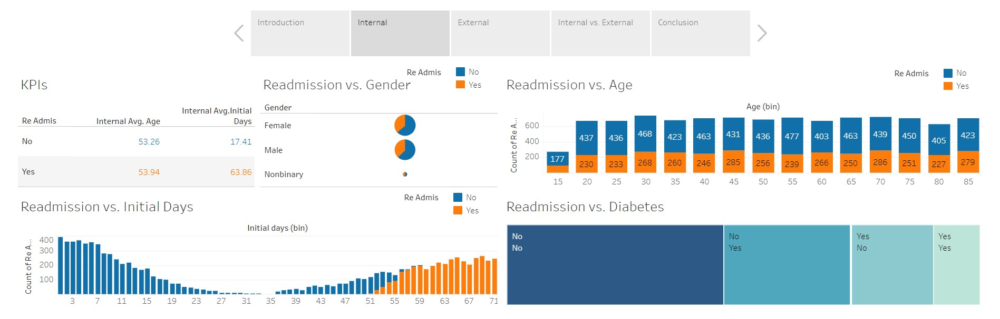

# Hospital Readmission Analysis

This analysis supports a hospital chain with an excessive readmission rate. If a patient returns to the hospital after their initial treatment to seek further medical help, they are considered to be readmitted. Readmission rate is a standard that hospitals must comply by, and if a hospital readmits too high of a percentage of patients in a year then they will be heavily fined by the medical board. 

The analysis visualizes the data of the hospital chain with high readmission, and identifies what kind of patient are being readmitted at an above expected rate when compared to an external hospital with acceptable readmission rates.

The interactive visualization and SQL data joining are done on this  [Tableau workbook.](https://public.tableau.com/views/D210_medical_workbook/Story1?:language=en-US&:sid=&:display_count=n&:origin=viz_share_link) A snippet of the workbook is shown below.

The statistical tests used to verify the conclusions of the data visualizations can be found in this [Jupyter Notebook.](Readmission_Tests.ipynb)

# Results Summary
If the external data can be considered a nominal hospitals performance, then with 95% confidence the following can be asserted:
- Readmission rate for the at risk hospital is correlated with the patients initial days. Patients who are initially admitted for over 2 months are extremely likely to return. This is not seen in the external data.
- The at risk hospital readmits on average a person with higher initial days compared to the external data.
- The external data shows there is a significant average age gap between those readmitted and not readmitted. This is not present in the at risk data. The at risk hospital is readmitting a remarkably younger average patient compared to the external hospital.
- The external data readmits more females than males, but the at risk hospital readmits the same ratio of males and females. The at risk hospital is readmitting too many males.

**The hospital needs to focus on better treating younger male patients who stay in the hospital for over 2 months initially to lower their readmission rate, and avoid being fined.**

